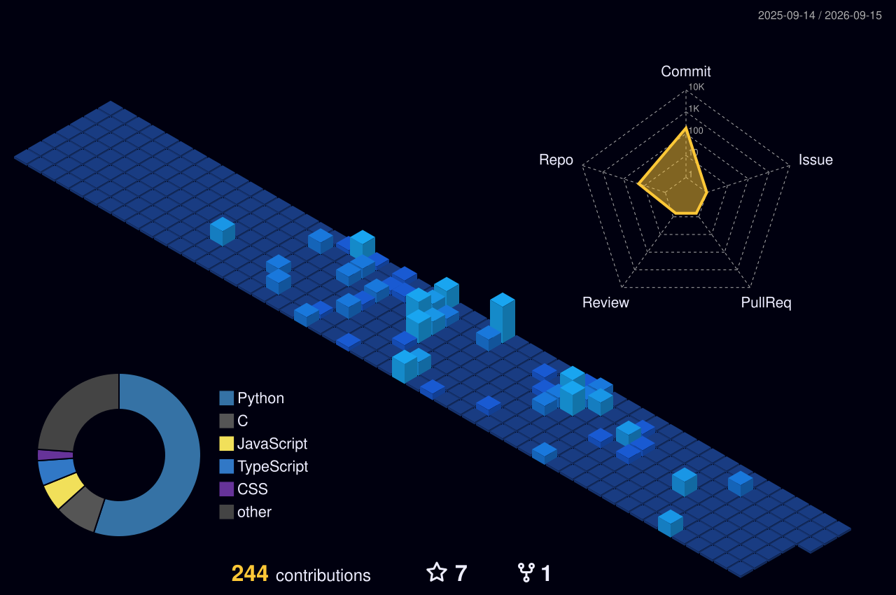

<h1 align="center">Hey, I'm Arnab Datta 👋</h1>

  <em>First-year CS student · Python · ML & Computer Vision · Building things that work in the real world</em>

  

  

---

### About Me

I'm a Computer Science student at **St. Xavier's College, Burdwan** with a focus on machine learning, computer vision, and backend systems. I like understanding how things work under the hood — most of my projects start as a question and end up as something I didn't plan to build.

- 🔭 Currently interning at **Venture Launcher** — building ML pipelines and recommendation systems
- 🧪 Previously interned at **QSkill** — Python development, NLP, and ML models
- 🎨 Outside of code — I paint. Watercolour, oil, sketching. Occasionally wins things there too.
- 📍 Burdwan, West Bengal, India &nbsp;·&nbsp; 🤝 Open to internships and collaborations

---

### 🏆 Highlight

**[TRACE — Automated Littering Detection & Alert System](https://github.com/Arnab500th/Hackathon-Automated-Littering-Detection-and-Alert-System-for-Public-Spaces)**
🥈 **2nd Place — NextGenHack 2026**

Real-time AI surveillance pipeline — YOLOv8 + ByteTrack + 5-state machine + Haversine geofencing + Twilio WhatsApp alerts routed to the nearest municipality office by GPS. Built end-to-end in under 4 days.

---

### 🧰 Tech Stack

| Category | Technologies |
|---|---|
| 💻 **Languages** |    |
| 🎨 **Frontend** |    |
| ⚙️ **Backend** |   |
| 🤖 **AI / Machine Learning** |       |
| 🗄 **Databases** |   |
| ⚡ **Messaging** |  |
| 🛠 **Tools** |   |

---

### 📌 Featured Projects

| Project | What it does |
|---|---|
| [TRACE](https://github.com/Arnab500th/Hackathon-Automated-Littering-Detection-and-Alert-System-for-Public-Spaces) | Real-time littering detection + WhatsApp alerts · 🥈 NextGenHack 2026 |
| [Subway Surfers Pose Control](https://github.com/Arnab500th/Subway-Surfers-Pose-Control-Game-Computer-Vision-) | Full-body gesture control via webcam using MediaPipe |
| [Computational String Art](https://github.com/Arnab500th/Computational-String-Art) | Greedy algorithm converts images into circular string art |
| [Speed Dating Compatibility Predictor](https://github.com/Arnab500th/Speed-Dating-Compatibility-Predictor) | ML model + Flask app to predict compatibility probability |

---

### 📊 GitHub Stats

  

---

### 🐍 Contribution Snake

  
  

---

### 🌐 Connect

  
  
  
  
  
  

  
  <em><b>I love connecting with different people</b> — feel free to reach out!</em>

