  
  

<!-- Badge row -->

  
  &nbsp;
  
  &nbsp;
  
  &nbsp;
  

  

---

### About Me

I'm a Computer Science student at **St. Xavier's College, Burdwan** with a focus on machine learning, computer vision, and backend systems. I like understanding how things work under the hood — most of my projects start as a question and end up as something I didn't plan to build.

<table border="0" cellpadding="6">
<tr>
<td valign="top" width="50%">

🔭 Currently interning at **Venture Launcher** — building ML pipelines and recommendation systems  
🧪 Previously interned at **QSkill** — Python development, NLP, and ML models  

</td>
<td valign="top" width="50%">

🎨 Outside of code — I paint. Watercolour, oil, sketching. Occasionally wins things there too.  
📍 Burdwan, West Bengal, India &nbsp;·&nbsp; 🤝 Open to internships and collaborations  

</td>
</tr>
</table>

🌱 **Currently learning** — PyTorch · Deep Learning · Computer Vision (advanced) · C (systems-level)

---

🏆 Highlight — NextGenHack 2026 🥈

 

**[TRACE — Automated Littering Detection & Alert System](https://github.com/Arnab500th/Hackathon-Automated-Littering-Detection-and-Alert-System-for-Public-Spaces)**
🥈 **2nd Place — NextGenHack 2026**

Real-time AI surveillance pipeline — YOLOv8 + ByteTrack + 5-state machine + Haversine geofencing + Twilio WhatsApp alerts routed to the nearest municipality office by GPS. Built end-to-end in under 4 days.

---

🧰 Tech Stack

 

| Category | Technologies |
|---|---|
| 💻 **Languages** |    |
| 🎨 **Frontend** |    |
| ⚙️ **Backend** |   |
| 🤖 **AI / Machine Learning** |       |
| 🗄 **Databases** |   |
| ⚡ **Messaging** |  |
| 🛠 **Tools** |   |

---

📌 Featured Projects

 

| Project | What it does |
|---|---|
| [TRACE](https://github.com/Arnab500th/Hackathon-Automated-Littering-Detection-and-Alert-System-for-Public-Spaces) | Real-time littering detection + WhatsApp alerts · 🥈 NextGenHack 2026 |
| [Subway Surfers Pose Control](https://github.com/Arnab500th/Subway-Surfers-Pose-Control-Game-Computer-Vision-) | Full-body gesture control via webcam using MediaPipe |
| [Computational String Art](https://github.com/Arnab500th/Computational-String-Art) | Greedy algorithm converts images into circular string art |
| [Speed Dating Compatibility Predictor](https://github.com/Arnab500th/Speed-Dating-Compatibility-Predictor) | ML model + Flask app to predict compatibility probability |

---

⏱️ WakaTime Coding Activity

 

  

---

📊 GitHub Stats

 

  

  

  

---

### 🐍 Contribution Snake

  
  

---

### 🌐 Connect

  

  
  &nbsp;&nbsp;&nbsp;
  
  &nbsp;&nbsp;&nbsp;
  
  &nbsp;&nbsp;&nbsp;
  
  &nbsp;&nbsp;&nbsp;
  
  &nbsp;&nbsp;&nbsp;
  
  &nbsp;&nbsp;&nbsp;
  
  &nbsp;&nbsp;&nbsp;
  

  
